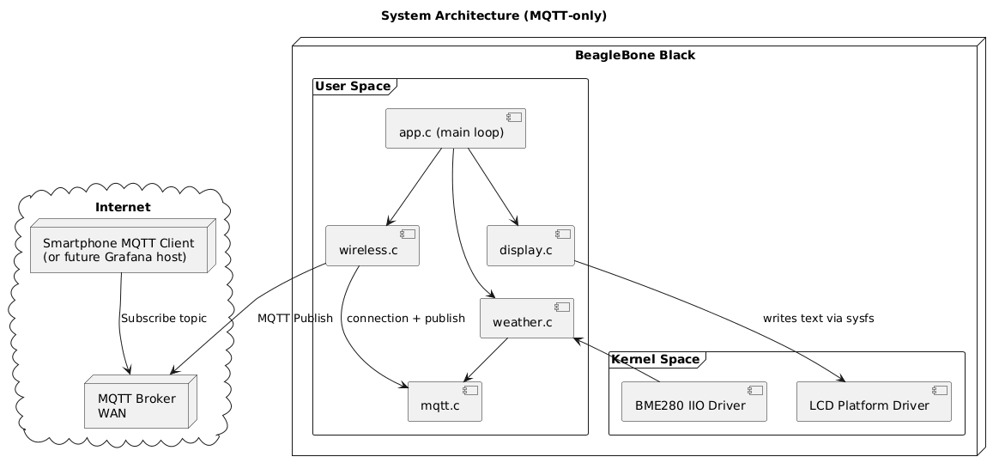
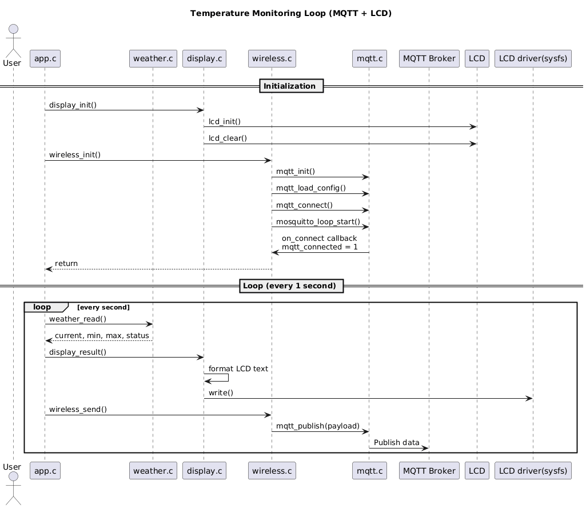

# Linux Temperature Monitoring Station – BeagleBone Black

This project implements a **minimal embedded Linux temperature monitoring system** based on the BeagleBone Black.  
It demonstrates a clean and realistic embedded Linux architecture, from **hardware description using the Device Tree**, to **kernel drivers**, and a **userspace application** interacting exclusively through **sysfs**.

The system continuously measures temperature using a **BME280 sensor**, interprets the data using simple deterministic logic, and displays the system state on a **16x2 character LCD**.

---

## Problem Statement

Small embedded systems often need to **monitor environmental temperature locally**, without relying on network connectivity, while remaining **observable, deterministic, and easy to debug** from Linux userspace.

This project implements a **local temperature monitoring station** that:
- acquires temperature data from hardware sensors via the Linux kernel
- interprets the measurements using explicit thresholds
- keeps track of minimum and maximum observed values
- provides immediate feedback through a character LCD

The system is designed to be simple, deterministic, and fully explainable.

---

## Project Overview

The goal of this project is to build a small but realistic embedded Linux system where:
- hardware is described using the **Device Tree**
- the Linux kernel handles all hardware access
- userspace interacts **only through sysfs interfaces**
- application logic remains entirely in userspace

At no point does the userspace application access GPIOs or I²C directly.

### Architecture Diagram



---

### Sequence Diagram



---

### Global data flow

**Hardware → Device Tree → Kernel subsystems → Kernel drivers → sysfs → Userspace application**

---

## Hardware

**Board**
- BeagleBone Black (AM335x)

**Peripherals**
- BME280 environmental sensor (temperature source)
- LCD 16x2 character display (4-bit mode)

The BME280 sensor is connected to the **I²C1 bus** at address `0x76`.  
The LCD is driven through GPIOs using a **custom Linux platform driver**.

---

## Architecture

The system is structured as follows:
- temperature acquisition is handled by the standard Linux **IIO BME280 driver**
- display control is handled by a **custom LCD platform driver**
- userspace reads sensor values and sends display commands through sysfs

This strict separation keeps hardware access confined to the kernel.

---

## GPIO and Pin Connections

### LCD 16x2 (4-bit mode)

| LCD Signal | BeagleBone Black GPIO |
|----------|------------------------|
| RS | gpio2_2 |
| RW | gpio2_3 |
| EN | gpio2_4 |
| D4 | gpio1_12 |
| D5 | gpio0_26 |
| D6 | gpio1_14 |
| D7 | gpio0_27 |

All GPIOs are configured through **am33xx-pinmux** in the Device Tree.

---

### BME280 (I²C1)

| Signal | BeagleBone Black |
|------|------------------|
| SDA | I2C1_SDA |
| SCL | I2C1_SCL |
| Address | `0x76` |

---

## Device Tree Description

The hardware configuration is defined in `am335x-boneblack-custom.dtsi`.

### Pinmux

The `am33xx-pinmux` node configures:
- GPIO pins used by the LCD via `lcd_pinctrl`
- I²C1 pins via `i2c1_pins`

### LCD Node

The LCD device:
- uses the compatible string `org,bone-lcd`
- references `lcd_pinctrl`
- declares all control and data GPIOs
- is bound to a custom platform driver

### BME280 Node

The BME280 device:
- is attached to the `i2c1` bus
- uses the compatible string `bosch,bme280`
- is handled by the standard Linux IIO driver

---

## Kernel Space

### Subsystems
- I²C subsystem for sensor communication
- GPIO subsystem for LCD control

### Drivers
- **BME280 IIO driver** (standard Linux driver)
- **LCD 16x2 platform driver** (custom)

The BME280 driver exposes raw temperature data via **sysfs (IIO)**.  
The LCD driver exposes sysfs entries to:
- clear the display
- write text
- move the cursor

---

## Userspace Application

The userspace application is written in **C**.

### Responsibilities
- read raw temperature values from sysfs
- maintain **current, minimum, and maximum temperature**
- determine a **temperature status**
- format and display information on the LCD
- refresh the display periodically

### sysfs paths used
- BME280: `/sys/bus/iio/devices/iio:device0/`
- LCD: `/sys/class/bone_lcd/lcd_16x2/`

---

## Temperature Status Definition

Temperature status is derived from coarse thresholds based on **human thermal comfort** in indoor environments.

- **LOW**    : temperature < 15 °C  
- **MEDIUM** : 15 °C ≤ temperature ≤ 28 °C  
- **HIGH**   : temperature > 28 °C  

Thresholds are intentionally wide to ensure **stable behavior** on a character LCD and to keep the system fully **deterministic and explainable**.

---

## Display Behavior (LCD 16x2)

### Line 1
```
T:28.3C ST:MED
```

### Line 2
```
LO/HI 19.0/30.0
```

---

## Build and Run

### Load the LCD driver

```bash
make
insmod lcd_platform_driver.ko
```

Verify:
```bash
ls /sys/class/bone_lcd/lcd_16x2/
```

---

### Verify BME280

```bash
ls /sys/bus/iio/devices/iio:device0/
cat in_temp_input
```

---

### Build and run the application

```bash
make app
./app.elf
```

---

## What This Project Demonstrates

- Proper use of the Linux Device Tree
- Platform driver development
- IIO-based sensor integration
- sysfs-based kernel/userspace communication
- Deterministic userspace application logic
- Clean embedded Linux system architecture

